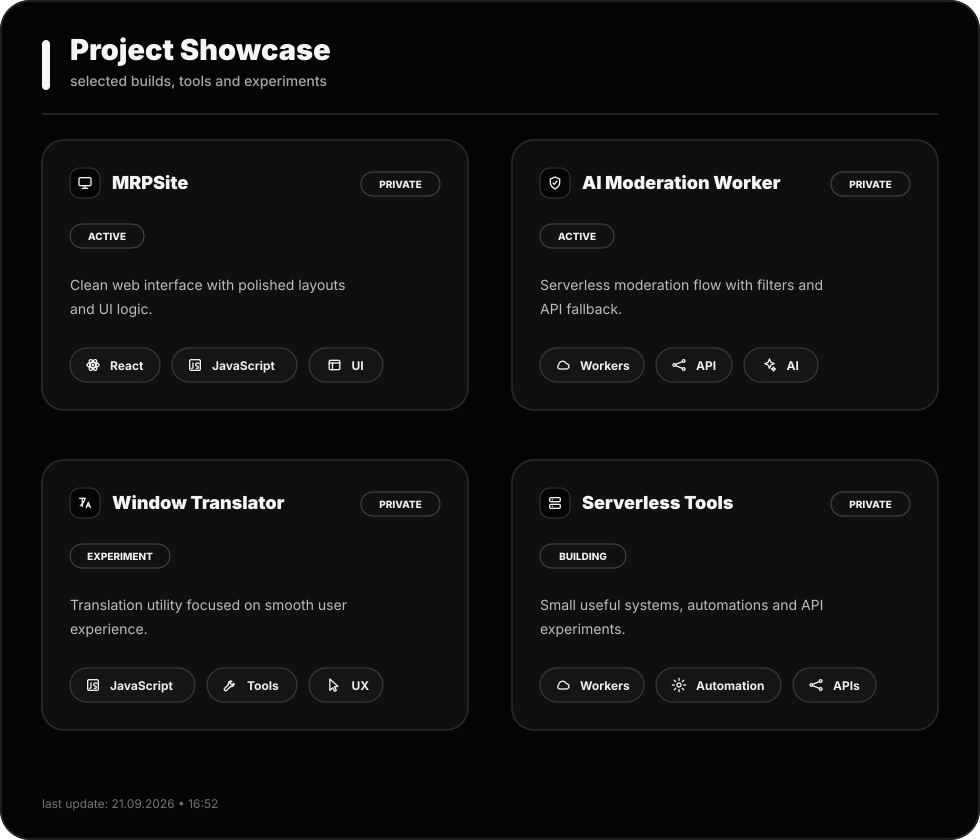

<div align="center">


</div>

---

## `whoami`

```txt
name        Semoof
username    None116
role        Web / Serverless Developer
focus       web apps, serverless tools, AI-powered utilities
status      building quietly
```

---

## Current Build

```txt
working on   private web projects
learning     better UI, APIs, deployment
using        JavaScript, React, Cloudflare Workers
style        clean monochrome
```

---

## Tech Stack

<div align="center">

### Core


<br/>

### Runtime & Serverless


<br/>

### APIs & Tools


<br/>

### Workflow


</div>

---

## Project Showcase

<div align="center">



</div>

---

## GitHub Stats

<div align="center">


</div>

---

<div align="center">


</div>
---

## Mode

```txt
learning      always
building      quietly
repos         mostly private
commits       visible
secrets       never pushed
```

---

<div align="center">


<br/>


</div>
